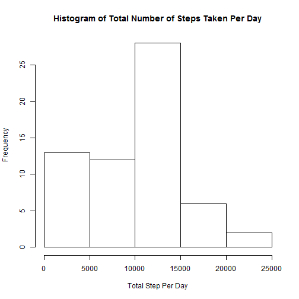
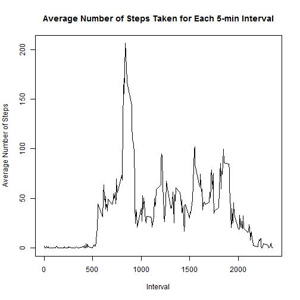
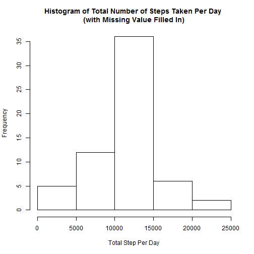
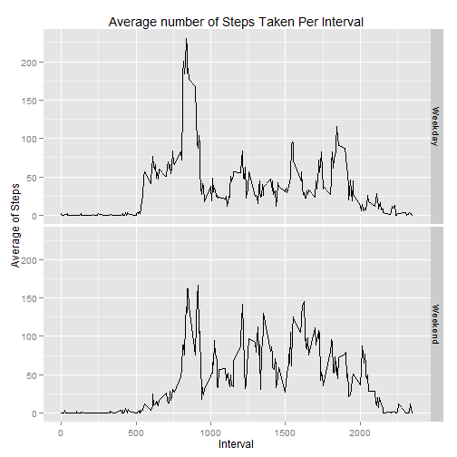

# Reproducible Research: Peer Assessment 1

## Loading and preprocessing the data
Download the file into working directory, and unzip the file.
Load the data into R.

```r
activityData <- read.csv("activity.csv")
```


## What is mean total number of steps taken per day?

Calculate the total number of steps taken per day. Missing value is ignored here. Then draw a histogram of the total number of steps taken per day.

```r
totalStepPerDay <- with(activityData, tapply(steps, date, function(x) sum(x, na.rm = TRUE)))

hist(totalStepPerDay, main = "Histogram of Total Number of Steps Taken Per Day", xlab = "Total Step Per Day")
```

 

Calculate and report the mean and median total number of steps taken per day

```r
mean_totalStep <- mean(totalStepPerDay)
median_totalStep <- median(totalStepPerDay)
```
Mean of the total number of steps taken per day is 9354.2295.
Median of the total number of steps taken per day is 10395.


## What is the average daily activity pattern?

To answer the question, firstly calculate the average number of steps taken per 5-minute interval. A data frame is created with 2 columns: identifier of 5-minute interval, average number of steps (averaged across all days) taken for the interval. Missing values are ignored here.

```r
aveStepPerInt <- with(activityData, tapply(steps, interval, function(x) mean(x, na.rm = TRUE)))

aveStepPerInt <- data.frame(names(aveStepPerInt), aveStepPerInt, row.names = NULL)
names(aveStepPerInt) <- c("Interval", "aveStep")
aveStepPerInt$aveStep <- as.numeric(as.character(aveStepPerInt$aveStep))
aveStepPerInt$Interval <- as.numeric(as.character(aveStepPerInt$Interval))
```

Make a time series plot of the 5-minute interval (x-axis) and the average number of steps taken, averaged across all days (y-axis)

```r
with(aveStepPerInt, plot(Interval, aveStep, type = "l", xlab = "Interval", ylab = "Average Number of Steps", main = "Average Number of Steps Taken for Each 5-min Interval"))
```

 

Which 5-minute interval, on average across all the days in the dataset, contains the maximum number of steps?

```r
rmax <- which.max(aveStepPerInt$aveStep)
maxInt <- aveStepPerInt[rmax, 1]
maxStep <- aveStepPerInt[rmax, 2]
```
The identifier of the 5-min interval containing the maximum number of steps is 835, and the maximum number of steps is 206.1698


## Inputing missing values

There are a number of days/intervals where there are missing values (coded as NA). The presence of missing days may introduce bias into some calculations or summaries of the data.

Calculate and report the total number of missing values in the dataset (i.e. the total number of rows with NAs)

```r
stepMiss <- activityData[is.na(activityData$steps), ]
nrowMiss <- nrow(stepMiss)
```
Total number of missing values in the dataset is 2304.

If step value is missing, use the mean of that 5-minute interval to fill in the value. Then create a new dataset that is equal to the original dataset but with the missing data filled in.

```r
stepMiss$steps <- sapply(stepMiss$interval, function(x) aveStepPerInt[aveStepPerInt$Interval==x,2])

stepHasValue <- activityData[!is.na(activityData$steps), ]
activityData2 <- rbind(stepHasValue, stepMiss)
```

Make a histogram of the total number of steps taken each day with missing value filled in. 

```r
totalStepPerDay2 <- with(activityData2, tapply(steps, date, sum))
hist(totalStepPerDay2)
```

 

Calculate and report the mean and median total number of steps taken per day.

```r
mean_totalStep2 <- mean(totalStepPerDay2)
median_totalStep2 <- median(totalStepPerDay2)
```
Mean of the total number of steps taken per day is 1.0766 &times; 10<sup>4</sup>.
Median of the total number of steps taken per day is 1.0766 &times; 10<sup>4</sup>.

With missing value filled in, total number of steps taken every day increases. From the histogram we can see that the frequency of 0-5000 decreases while the frequency of 10000-15000 increases.


## Are there differences in activity patterns between weekdays and weekends?

Create a new factor variable in the dataset with two levels - "weekday" and "weekend" indicating whether a given date is a weekday or weekend day.

```r
activityData2$date <- as.Date(activityData2$date, format = "%Y-%m-%d")
activityData2$weekday <- weekdays(activityData2$date)

weekday <- data.frame(c("Monday", "Tuesday", "Wednesday", "Thursday", "Friday", "Saturday","Sunday"), c("Weekday", "Weekday", "Weekday", "Weekday", "Weekday", "Weekend", "Weekend"))
names(weekday) <- c("Weekday", "WeekdayOrWeekend")
activityData2$weekend <- sapply(activityData2$weekday, function(x) weekday[weekday$Weekday==x, 2])
```

Split the data according to weekday and weekend. Calculate the average number of steps taken for each 5-min interval for weekday data and weekend data. Corresponding data frames are created with 2 columns: Identifier of the 5-min interval, Average steps taken per interval. Combine the data frames for the convenience of plotting.

```r
activityData2 <- split(activityData2, activityData2$weekend)

aveStepPerIntWkd <- with(activityData2[[1]], tapply(steps, interval, mean))
aveStepPerIntWkd <- data.frame(names(aveStepPerIntWkd), aveStepPerIntWkd, "Weekday", row.names = NULL)
names(aveStepPerIntWkd) <- c("Interval", "aveStep", "WeekdayOrWeekend")

aveStepPerIntWkend <- with(activityData2[[2]], tapply(steps, interval, mean))
aveStepPerIntWkend <- data.frame(names(aveStepPerIntWkend), aveStepPerIntWkend, "Weekend", row.names = NULL)
names(aveStepPerIntWkend) <- c("Interval", "aveStep", "WeekdayOrWeekend")

aveStepPerInt2 <- rbind(aveStepPerIntWkd, aveStepPerIntWkend)
aveStepPerInt2$aveStep <- as.numeric(as.character(aveStepPerInt2$aveStep))
aveStepPerInt2$Interval <- as.numeric(as.character(aveStepPerInt2$Interval))
```

Make a panel plot containing a time series plot of the 5-minute interval (x-axis) and the average number of steps taken, averaged across all weekday days or weekend days (y-axis). 

```r
library(ggplot2)
qplot(Interval, aveStep, data = aveStepPerInt2, geom="line", facets=WeekdayOrWeekend ~., xlab = "Interval", ylab = "Average of Steps", main = "Average number of Steps Taken Per Interval")
```

 
